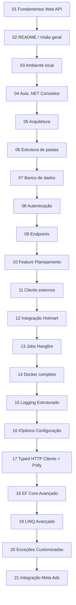

# Trilha de Aprendizado — Documentação VBBS Manager API

> **Objetivo:** ler a documentação na ordem certa para aprender C# e .NET Web API usando este projeto — do zero até integrações externas e deploy.

**Perfil:** você já programa em outra linguagem (PHP/Laravel, Node, Angular) e está usando o VBBS Manager como laboratório.

**Como usar esta trilha:** siga a numeração. Cada documento assume que você leu os anteriores. Não pule o **01** nem o **04** — são a base de tudo.

---

## Mapa visual da trilha



---

## Ordem de leitura (numerada)

### Fase 0 — Fundamentos (leia antes de codar)

| # | Documento | O que você aprende | Tempo estimado |
|---|---|---|---|
| **01** | [01-aula-fundamentos-web-api.md](./01-aula-fundamentos-web-api.md) | HTTP, REST, JSON, Swagger, configuração, tipos de auth, webhooks | 45–60 min |

> **Por que começar aqui?** Os outros documentos assumem que você sabe o que é um `GET`, um JWT e um `.env`. Esta aula preenche essa lacuna.

---

### Fase 1 — Contexto e mãos na massa

| # | Documento | O que você aprende | Tempo estimado |
|---|---|---|---|
| **02** | [02-readme.md](./02-readme.md) | Stack do projeto, índice geral, visão de 5 minutos | 10 min |
| **03** | [03-ambiente-local.md](./03-ambiente-local.md) | Clonar, Docker, migrations, `dotnet run`, Swagger, pgAdmin | 30–45 min |

> **Meta da Fase 1:** API rodando em `localhost:5000`, Swagger abrindo, banco PostgreSQL no Docker.

**Exercício prático:**
1. Suba o ambiente seguindo o doc 03
2. Abra `http://localhost:5000/swagger`
3. Faça login (se houver seed) ou explore endpoints públicos

---

### Fase 2 — C# e .NET aplicados ao projeto (núcleo)

| # | Documento | O que você aprende | Tempo estimado |
|---|---|---|---|
| **04** | [04-aula-dotnet-conceitos.md](./04-aula-dotnet-conceitos.md) | Solution, namespaces, Vertical Slice, records, DI, EF Core, Controllers, Services, middleware, JWT, async/await, fluxo completo de requisição | 3–5 horas (leia em partes) |

> **Este é o documento mais importante da trilha.** Leia com o código aberto no IDE. Cada seção aponta para arquivos reais do repositório.

**Ordem sugerida dentro do doc 04** (se não ler de uma vez):

1. Seções 1–4 → estrutura e sintaxe C#
2. Seções 5–7 → entidades e banco
3. Seções 8–10 → DI, Controllers, Services
4. Seções 11–14 → records, middleware, auth, async
5. Seções 15–18 → multi-tenant e fluxo completo

---

### Fase 3 — Arquitetura e mapa do código

| # | Documento | O que você aprende | Tempo estimado |
|---|---|---|---|
| **05** | [05-arquitetura.md](./05-arquitetura.md) | Domain / Infrastructure / Api, Vertical Slice, pipeline HTTP, multi-tenancy, Result pattern | 30 min |
| **06** | [06-estrutura-de-pastas.md](./06-estrutura-de-pastas.md) | Onde fica cada arquivo, convenções de nomenclatura | 20 min (use como referência) |

> **Dica:** o doc 06 não precisa ser lido de ponta a ponta — use como **mapa** enquanto navega o código.

---

### Fase 4 — Dados e segurança

| # | Documento | O que você aprende | Tempo estimado |
|---|---|---|---|
| **07** | [07-banco-de-dados.md](./07-banco-de-dados.md) | Tabelas, relações, tenant_id, migrations, isolamento | 30 min |
| **08** | [08-autenticacao.md](./08-autenticacao.md) | Fluxo JWT + Refresh Token, claims, revogação | 25 min |

> **Conexão:** depois do 08, volte ao Swagger e teste login → Authorize → endpoint protegido.

---

### Fase 5 — A API na prática

| # | Documento | O que você aprende | Tempo estimado |
|---|---|---|---|
| **09** | [09-endpoints.md](./09-endpoints.md) | Referência de todas as rotas, request/response JSON | Consulta |
| **10** | [10-feature-planejamento.md](./10-feature-planejamento.md) | Feature real ponta a ponta: entidade → migration → service → controller → frontend | 1–2 horas |

> **Por que o 10 depois do 09?** O doc 10 mostra **como uma feature nasce** — conecta tudo que você leu nos docs 04–09 em um exemplo concreto.

---

### Fase 6 — Integrações externas

| # | Documento | O que você aprende | Tempo estimado |
|---|---|---|---|
| **11** | [11-clients-externos.md](./11-clients-externos.md) | Padrão de clients HTTP, Polly retry, logging, credenciais por tenant | 20 min |
| **12** | [12-integracao-hotmart-vendas.md](./12-integracao-hotmart-vendas.md) | OAuth Hotmart, paginação, DTOs, Typed Clients, consolidação de vendas — passo a passo para iniciantes | 1–1,5 hora |

> **Pré-requisito:** ter `HOTMART_CLIENT_ID` e `HOTMART_CLIENT_SECRET` no `.env` para testar de verdade (doc 12, seção 4).

---

### Fase 7 — Background e infraestrutura

| # | Documento | O que você aprende | Tempo estimado |
|---|---|---|---|
| **13** | [13-jobs.md](./13-jobs.md) | Hangfire, jobs recorrentes, sync Hotmart/Meta, dashboard | 25 min |
| **14** | [14-docker.md](./14-docker.md) | Containers, Dockerfile multi-stage, Compose, produção, volumes, redes | 2–3 horas (referência) |

> **Ordem do 13 vs 14:** leia Jobs antes de Docker completo — você entende *o que* roda em background antes de *como* empacotar em container. Para subir o banco local, o doc 03 já bastou; o 14 aprofunda para deploy.

---

### Fase 8 — Infraestrutura de código avançada

Estes documentos cobrem conceitos implementados no projeto que não estavam na trilha original. Leia na sequência — cada doc referencia os anteriores.

| # | Documento | O que você aprende | Tempo estimado |
|---|---|---|---|
| **15** | [15-logging-estruturado.md](./15-logging-estruturado.md) | `ILogger<T>`, níveis de log, structured logging vs string interpolation, logging em middleware e jobs | 20 min |
| **16** | [16-ioptions-configuracao.md](./16-ioptions-configuracao.md) | `IOptions<T>`, Settings classes tipadas, como variáveis de ambiente chegam às classes | 20 min |
| **17** | [17-typed-http-clients-polly.md](./17-typed-http-clients-polly.md) | Typed HTTP Clients, `AddHttpClient<I,T>`, Polly, backoff exponencial, BaseAddress, URI encoding | 25 min |
| **18** | [18-ef-core-avancado.md](./18-ef-core-avancado.md) | `AsNoTracking()`, `ExecuteDeleteAsync()`, transações com `BeginTransactionAsync`, `await using` | 25 min |
| **19** | [19-linq-avancado.md](./19-linq-avancado.md) | `Select` com projeção e índice, `GroupBy`, `Dictionary<K,V>`, spread operator, `TryParse` + `InvariantCulture`, `DateTimeOffset` | 30 min |
| **20** | [20-excecoes-customizadas.md](./20-excecoes-customizadas.md) | Quando usar Exception vs Result, hierarquia de exceções, `throw` vs `throw ex`, catch por nível | 20 min |
| **21** | [21-integracao-meta-ads.md](./21-integracao-meta-ads.md) | Cursor-based pagination, hierarquia Campaign/AdSet/Ad, sync atômico, `omni_purchase`, tuplas de retorno | 45 min |

> **Por que esta fase após Docker?** Os docs 15–21 cobrem padrões usados nas integrações externas (Meta Ads, Hotmart). São conceitos que fazem mais sentido depois de você ter o sistema rodando (docs 1–14).

---

## Tabela resumida — todos os documentos

| # | Arquivo | Fase | Tipo |
|---|---|---|---|
| 01 | `01-aula-fundamentos-web-api.md` | 0 | Aula (novo) |
| 02 | `02-readme.md` | 1 | Índice |
| 03 | `03-ambiente-local.md` | 1 | Guia prático |
| 04 | `04-aula-dotnet-conceitos.md` | 2 | Aula principal |
| 05 | `05-arquitetura.md` | 3 | Referência |
| 06 | `06-estrutura-de-pastas.md` | 3 | Mapa |
| 07 | `07-banco-de-dados.md` | 4 | Referência |
| 08 | `08-autenticacao.md` | 4 | Referência |
| 09 | `09-endpoints.md` | 5 | Referência |
| 10 | `10-feature-planejamento.md` | 5 | Estudo de caso |
| 11 | `11-clients-externos.md` | 6 | Referência |
| 12 | `12-integracao-hotmart-vendas.md` | 6 | Aula integração |
| 13 | `13-jobs.md` | 7 | Referência |
| 14 | `14-docker.md` | 7 | Aula infra |
| 15 | `15-logging-estruturado.md` | 8 | Aula |
| 16 | `16-ioptions-configuracao.md` | 8 | Aula |
| 17 | `17-typed-http-clients-polly.md` | 8 | Aula |
| 18 | `18-ef-core-avancado.md` | 8 | Aula |
| 19 | `19-linq-avancado.md` | 8 | Aula |
| 20 | `20-excecoes-customizadas.md` | 8 | Aula |
| 21 | `21-integracao-meta-ads.md` | 8 | Estudo de caso |

---

## Lacunas que esta trilha cobre

Ao organizar a documentação, identificamos conceitos **não explicados** em nenhum doc antigo. Eles foram reunidos em documentos específicos:

| Lacuna | Onde foi resolvido |
|---|---|
| O que é HTTP/REST/Web API | Doc 01, seções 1–3 |
| Status codes e métodos HTTP | Doc 01, seção 2 |
| JSON e conversão para C# | Doc 01, seção 4 |
| Pipeline Request → Controller (visão inicial) | Doc 01, seção 5 |
| Swagger para testes | Doc 01, seção 6 |
| appsettings vs .env vs `IConfiguration` | Doc 01, seção 7 |
| JWT do painel vs OAuth da Hotmart | Doc 01, seção 8 |
| O que são webhooks | Doc 01, seção 9 |
| `ILogger<T>` e logging estruturado | Doc 15 |
| `IOptions<T>` e configuração tipada | Doc 16 |
| Typed HTTP Clients e retry com Polly | Doc 17 |
| `AsNoTracking`, `ExecuteDeleteAsync`, transações | Doc 18 |
| `GroupBy`, `Dictionary`, `TryParse` + `InvariantCulture` | Doc 19 |
| Hierarquia de exceções customizadas | Doc 20 |
| Cursor pagination, hierarquia Meta Ads, sync atômico | Doc 21 |

**Aprofundados nos docs originais** (não duplicados):

| Conceito | Documento principal |
|---|---|
| C# / sintaxe / DI / EF / Controllers | Doc 04 |
| Multi-tenancy | Docs 05, 07, 08 |
| Integração Hotmart linha a linha | Doc 12 |
| Docker produção | Doc 14 |
| Integração Meta Ads linha a linha | Doc 21 |

---

## Roteiro por objetivo

### "Quero aprender C# com este projeto"
```
01 → 03 → 04 (completo) → 05 → 10
```

### "Quero entender só a API REST que expomos"
```
01 → 03 → 04 (seções 8–12) → 08 → 09
```

### "Quero integrar APIs externas (Hotmart)"
```
01 → 04 (seções 8, 14) → 11 → 12 → 16 → 17
```

### "Quero integrar a Meta Ads API"
```
15 → 16 → 17 → 18 → 19 → 20 → 21
```

### "Quero subir em produção na VPS"
```
03 → 07 → 14 → 13
```

### "Quero entender os padrões avançados de infraestrutura de código"
```
15 → 16 → 17 → 18 → 19 → 20
```

---

## Documentos fora da trilha principal

| Arquivo | Quando consultar |
|---|---|
| [claude.md](../claude.md) (raiz API) | Contexto de produto, decisões de stack, roadmap — leitura opcional para visão de negócio |

---

## Próximo passo

**Comece agora:** [01-aula-fundamentos-web-api.md](./01-aula-fundamentos-web-api.md)

Depois: [03-ambiente-local.md](./03-ambiente-local.md) e [04-aula-dotnet-conceitos.md](./04-aula-dotnet-conceitos.md).

---

*Trilha mantida junto com a documentação em `API/documentacoes/`. Ao adicionar novos docs, inclua-os nesta lista com número e fase.*
