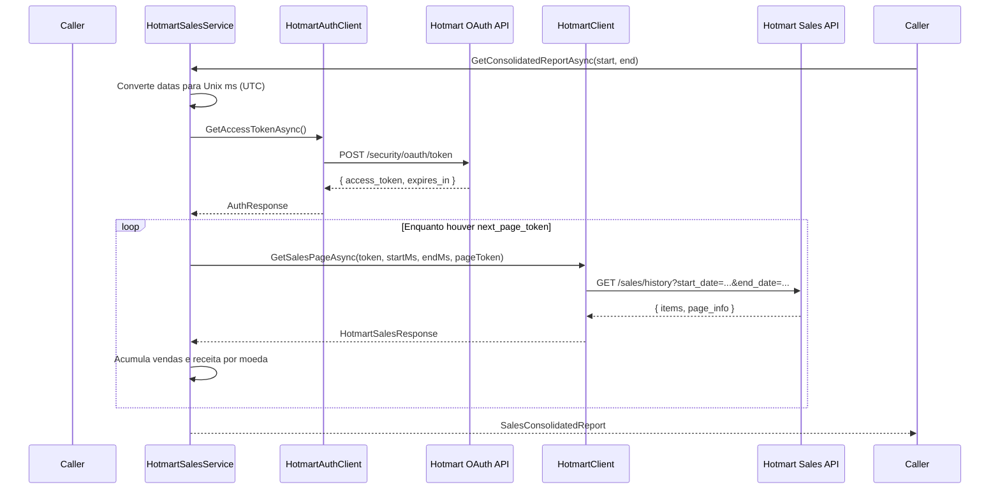

# Integração Hotmart — Histórico de Vendas (Sales History v1)

> **Para quem é este documento?**
> Para quem está aprendendo .NET e C# usando o VBBS Manager como laboratório. Aqui explicamos **do zero** como funciona a integração com a API de vendas da Hotmart: o que cada arquivo faz, por que existe, e como os conceitos de C# se encaixam na prática.

> **Ordem de leitura:** este é o **documento 12** da [Trilha de Aprendizado](./00-trilha-de-aprendizado.md). Leia antes [11-clients-externos.md](./11-clients-externos.md) e a seção 8 do [01-aula-fundamentos-web-api.md](./01-aula-fundamentos-web-api.md) (OAuth vs JWT).

**Documentos relacionados:**
- [Clients de API Externa](./11-clients-externos.md) — princípios gerais de integrações
- [Aula de .NET — Conceitos Aplicados](./04-aula-dotnet-conceitos.md) — DI, Records, Async/Await, Program.cs

---

## Sumário

1. [O que essa integração faz?](#1-o-que-essa-integração-faz)
2. [Visão geral do fluxo](#2-visão-geral-do-fluxo)
3. [Onde ficam os arquivos](#3-onde-ficam-os-arquivos)
4. [Configuração com arquivo .env](#4-configuração-com-arquivo-env)
5. [Como a aplicação lê o .env (Program.cs)](#5-como-a-aplicação-lê-o-env-programcs)
6. [Injeção de Dependência — registrando tudo](#6-injeção-de-dependência--registrando-tudo)
7. [Os DTOs (Records) — mapeando o JSON da Hotmart](#7-os-dtos-records--mapeando-o-json-da-hotmart)
8. [HotmartAuthClient — obtendo o token OAuth](#8-hotmartauthclient--obtendo-o-token-oauth)
9. [HotmartClient — buscando uma página de vendas](#9-hotmartclient--buscando-uma-página-de-vendas)
10. [HotmartSalesService — orquestrando tudo](#10-hotmartsalesservice--orquestrando-tudo)
11. [Conceitos de C# que você está aprendendo aqui](#11-conceitos-de-c-que-você-está-aprendendo-aqui)
12. [Como usar o serviço no seu código](#12-como-usar-o-serviço-no-seu-código)
13. [Erros comuns e como debugar](#13-erros-comuns-e-como-debugar)
14. [Próximos passos no projeto](#14-próximos-passos-no-projeto)

---

## 1. O que essa integração faz?

O objetivo é responder duas perguntas de negócio para um período de datas:

| Pergunta | Campo no retorno |
|---|---|
| Quantas vendas aprovadas/completas tive? | `TotalSales` |
| Quanto faturei, por moeda? | `TotalRevenueByCurrency` |

**Exemplo de retorno:**

```csharp
SalesConsolidatedReport(
    TotalSales: 232,
    TotalRevenueByCurrency: {
        "BRL": 12368.00m
    }
)
```

A Hotmart expõe isso via API REST. Nosso código:

1. Autentica com OAuth 2.0 (Client Credentials)
2. Busca o histórico de vendas paginado
3. Soma os valores e agrupa por moeda (`BRL`, `USD`, etc.)

> **Analogia com Laravel:** pense nisso como um `Service` que chama um `HttpClient` encapsulado, deserializa JSON para DTOs (`array` → objetos C#) e devolve um resultado consolidado — similar a um Job ou Command que sincroniza dados externos.

---

## 2. Visão geral do fluxo

Quando você chama `GetConsolidatedReportAsync(inicio, fim)`, acontece isto:



**Três camadas, três responsabilidades:**

| Classe | Responsabilidade |
|---|---|
| `HotmartAuthClient` | Só autentica — devolve o `access_token` |
| `HotmartClient` | Só busca **uma página** de vendas |
| `HotmartSalesService` | Orquestra auth + paginação + consolidação |

Separar assim é intencional: cada classe faz **uma coisa só**, o que facilita testar, debugar e reutilizar.

---

## 3. Onde ficam os arquivos

Todos os arquivos da integração Hotmart ficam em:

```
src/VBBSManager.Infrastructure/ExternalClients/Hotmart/
├── HotmartDtos.cs          ← Records que representam o JSON da API
├── HotmartSettings.cs      ← Classe de configuração (ClientId, ClientSecret)
├── HotmartAuthClient.cs    ← Client HTTP para OAuth
├── HotmartClient.cs        ← Client HTTP para vendas
└── HotmartSalesService.cs  ← Serviço de negócio (interface + implementação)
```

**Por que em `Infrastructure` e não em `Api`?**

- `Infrastructure` = detalhes técnicos (HTTP, banco, filas, APIs externas)
- `Api` = endpoints HTTP, controllers, features do painel

A integração com a Hotmart é um **detalhe técnico**. No futuro, um Controller em `Api` vai *usar* o serviço, mas a lógica de chamada HTTP fica isolada aqui.

O registro no container de DI (Dependency Injection) fica em:

```
src/VBBSManager.Api/Common/Extensions/ServiceCollectionExtensions.cs
```

E o carregamento do `.env` fica em:

```
src/VBBSManager.Api/Program.cs
```

---

## 4. Configuração com arquivo `.env`

As credenciais da Hotmart **nunca** devem ir para o código-fonte ou para o Git. Elas ficam no arquivo `.env`, que está no `.gitignore`.

**Template (`.env.example`):**

```env
# ── Hotmart API ──────────────────────────────────────────────────────────────
# Credenciais OAuth 2.0 (Client Credentials) — painel Hotmart > Ferramentas > Credenciais
HOTMART_CLIENT_ID=
HOTMART_CLIENT_SECRET=
```

**Como obter as credenciais:**

1. Acesse o painel da Hotmart
2. Vá em **Ferramentas → Credenciais de API** (ou equivalente no painel atual)
3. Crie/obtenha um `client_id` e `client_secret` do tipo **Client Credentials**

**Setup local:**

```bash
cd API
cp .env.example .env
# Edite o .env e preencha HOTMART_CLIENT_ID e HOTMART_CLIENT_SECRET
```

> **Analogia com Laravel:** o `.env` funciona como o `.env` do Laravel — variáveis lidas em runtime, nunca commitadas.

---

## 5. Como a aplicação lê o `.env` (Program.cs)

O ASP.NET Core, por padrão, lê variáveis de ambiente do sistema operacional. O pacote **DotNetEnv** carrega o arquivo `.env` e injeta essas variáveis no ambiente **antes** da aplicação subir.

```csharp
// Program.cs — linha 7
Env.TraversePath().Load();
```

**O que `TraversePath().Load()` faz?**

- Começa na pasta atual e **sobe** na árvore de diretórios
- Procura um arquivo chamado `.env`
- Quando encontra, carrega todas as variáveis dele

Isso é útil porque, dependendo de como você roda o projeto (`dotnet run` na pasta `Api` ou via Docker), a pasta de trabalho muda — mas o `.env` na pasta `API/` sempre será encontrado.

**Ordem de leitura de configuração no ASP.NET Core:**

1. `appsettings.json`
2. `appsettings.{Environment}.json`
3. Variáveis de ambiente (incluindo as do `.env` carregadas pelo DotNetEnv)
4. Argumentos de linha de comando

Variáveis de ambiente **sobrescrevem** o que está no `appsettings.json`. Por isso o `.env` funciona bem para segredos locais.

---

## 6. Injeção de Dependência — registrando tudo

No ASP.NET Core, você não faz `new HotmartClient()` manualmente. Você **registra** os serviços no container de DI, e o framework cria e injeta automaticamente.

```csharp
// ServiceCollectionExtensions.cs — método AddExternalClients
public static IServiceCollection AddExternalClients(
    this IServiceCollection services,
    IConfiguration configuration)
{
    // 1. Mapeia variáveis de ambiente para HotmartSettings
    services.Configure<HotmartSettings>(options =>
    {
        options.ClientId = configuration["HOTMART_CLIENT_ID"] ?? string.Empty;
        options.ClientSecret = configuration["HOTMART_CLIENT_SECRET"] ?? string.Empty;
    });

    // 2. Typed Client para autenticação OAuth
    services.AddHttpClient<IHotmartAuthClient, HotmartAuthClient>(client =>
        client.BaseAddress = new Uri("https://api-sec-vlc.hotmart.com"));

    // 3. Typed Client para vendas (com retry Polly)
    services.AddHttpClient<IHotmartClient, HotmartClient>(client =>
        client.BaseAddress = new Uri("https://developers.hotmart.com/payments/api/v1/"))
        .AddTransientHttpErrorPolicy(p =>
            p.WaitAndRetryAsync(3, attempt => TimeSpan.FromSeconds(Math.Pow(2, attempt))));

    // 4. Serviço de consolidação
    services.AddScoped<IHotmartSalesService, HotmartSalesService>();

    return services;
}
```

### O que cada registro significa

#### `services.Configure<HotmartSettings>(...)`

Lê `HOTMART_CLIENT_ID` e `HOTMART_CLIENT_SECRET` do `IConfiguration` e preenche um objeto `HotmartSettings`. Esse objeto é injetado via `IOptions<HotmartSettings>`.

**Por que `IOptions<T>` e não ler direto do `.env`?**

- Centraliza configuração em um objeto tipado
- Facilita testes (você pode mockar `IOptions<HotmartSettings>`)
- É o padrão recomendado no ecossistema .NET

#### `services.AddHttpClient<IHotmartAuthClient, HotmartAuthClient>(...)`

Registra um **Typed Client**: quando alguém pede `IHotmartAuthClient`, o framework cria um `HotmartAuthClient` já com um `HttpClient` configurado (incluindo `BaseAddress`).

**Por que Typed Client e não `new HttpClient()`?**

| Problema com `new HttpClient()` | Solução com `IHttpClientFactory` |
|---|---|
| Esgota sockets se criar muitos | Reutiliza conexões HTTP |
| Não tem retry configurável | Polly adiciona retry automático |
| Difícil de testar | Interface permite mock |

#### `.AddTransientHttpErrorPolicy(...)`

Se a API da Hotmart retornar erro 5xx ou timeout, o Polly tenta de novo:

- 1ª falha → espera 2 segundos → retenta
- 2ª falha → espera 4 segundos → retenta
- 3ª falha → espera 8 segundos → retenta

Isso evita falhas por instabilidade momentânea da API externa.

#### `services.AddScoped<IHotmartSalesService, HotmartSalesService>()`

Registra o serviço de negócio com ciclo de vida **Scoped** — uma instância por requisição HTTP.

| Ciclo de vida | Quando usar |
|---|---|
| `Singleton` | Uma instância para toda a aplicação |
| `Scoped` | Uma instância por requisição (padrão para services) |
| `Transient` | Nova instância toda vez que alguém pede |

---

## 7. Os DTOs (Records) — mapeando o JSON da Hotmart

Quando a API da Hotmart responde, ela manda JSON. Precisamos converter esse JSON em objetos C# — são os **DTOs** (Data Transfer Objects).

Usamos **`record`** em vez de `class` porque DTOs são dados imutáveis — você só lê, não altera.

```csharp
// HotmartDtos.cs

public record AuthResponse(
    [property: JsonPropertyName("access_token")] string AccessToken,
    [property: JsonPropertyName("expires_in")] int ExpiresIn);
```

### Por que `[JsonPropertyName("access_token")]`?

O JSON da Hotmart usa **snake_case** (`access_token`), mas em C# usamos **PascalCase** (`AccessToken`). O atributo diz ao deserializador: *"o campo JSON `access_token` vai para a propriedade `AccessToken`"*.

**JSON de autenticação (exemplo):**

```json
{
  "access_token": "eyJhbGciOiJIUzI1NiIs...",
  "expires_in": 3600
}
```

**JSON de vendas (estrutura simplificada):**

```json
{
  "items": [
    {
      "purchase": {
        "price": {
          "value": 69.90,
          "currency_code": "BRL"
        }
      }
    }
  ],
  "page_info": {
    "next_page_token": "abc123..."
  }
}
```

**Árvore de records que mapeiam isso:**

```
HotmartSalesResponse
├── Items: List<HotmartSaleItem>
│   └── HotmartSaleItem
│       └── Purchase: HotmartPurchase
│           └── Price: HotmartPrice
│               ├── Value: decimal
│               └── CurrencyCode: string
└── PageInfo: HotmartPageInfo
    └── NextPageToken: string?
```

**O `?` significa nullable** — o campo pode ser `null`. Ex.: na última página, `next_page_token` vem vazio ou ausente.

**Record de saída (nosso relatório consolidado):**

```csharp
public record SalesConsolidatedReport(
    int TotalSales,
    IReadOnlyDictionary<string, decimal> TotalRevenueByCurrency);
```

Usamos `IReadOnlyDictionary` porque pode haver vendas em moedas diferentes. Em vez de um único `TotalRevenue`, agrupamos por moeda:

```csharp
// Exemplo de conteúdo:
{ "BRL": 12368.00m, "USD": 150.00m }
```

---

## 8. HotmartAuthClient — obtendo o token OAuth

### O que é OAuth 2.0 Client Credentials?

É um fluxo onde a aplicação (servidor) se autentica **diretamente** com `client_id` + `client_secret`, sem envolver o usuário final. Ideal para integrações servidor-a-servidor.

**Endpoint:** `POST https://api-sec-vlc.hotmart.com/security/oauth/token`

**Passo a passo do código:**

```csharp
// 1. Lê credenciais do HotmartSettings (vindas do .env)
var clientId = settings.Value.ClientId;
var clientSecret = settings.Value.ClientSecret;

// 2. Valida se estão preenchidas
if (string.IsNullOrWhiteSpace(clientId) || string.IsNullOrWhiteSpace(clientSecret))
    throw new InvalidOperationException("Credenciais Hotmart não configuradas...");

// 3. Monta o header Authorization: Basic {Base64(client_id:client_secret)}
var credentials = Convert.ToBase64String(
    Encoding.UTF8.GetBytes($"{clientId}:{clientSecret}"));

// 4. Monta a requisição POST
using var request = new HttpRequestMessage(HttpMethod.Post, "/security/oauth/token");
request.Headers.Authorization = new AuthenticationHeaderValue("Basic", credentials);
request.Content = new FormUrlEncodedContent(new Dictionary<string, string>
{
    ["grant_type"] = "client_credentials"
});

// 5. Envia e valida resposta
var response = await httpClient.SendAsync(request, ct);
response.EnsureSuccessStatusCode();  // lança exceção se status != 2xx

// 6. Deserializa JSON → AuthResponse
var content = await response.Content.ReadAsStringAsync(ct);
var authResponse = JsonSerializer.Deserialize<AuthResponse>(content, JsonOptions);
```

### Conceitos importantes neste arquivo

| Código | O que é |
|---|---|
| `using var request = ...` | `using` garante que o objeto é descartado ao sair do escopo (libera memória) |
| `await httpClient.SendAsync(...)` | Chamada HTTP assíncrona — não trava a thread enquanto espera resposta |
| `CancellationToken ct` | Permite cancelar a operação se o usuário desistir ou a requisição expirar |
| `EnsureSuccessStatusCode()` | Se a API retornar 401, 500, etc., lança `HttpRequestException` |
| `?? throw new ...` | Operador null-coalescing: se deserialização retornar `null`, lança exceção |

**Por que `BaseAddress` + caminho relativo?**

O `HttpClient` foi configurado com `BaseAddress = "https://api-sec-vlc.hotmart.com"`. Na requisição usamos apenas `"/security/oauth/token"`. O framework concatena automaticamente → URL completa correta.

---

## 9. HotmartClient — buscando uma página de vendas

Este client busca **apenas uma página** por chamada. A paginação completa fica no `HotmartSalesService`.

**Endpoint:** `GET https://developers.hotmart.com/payments/api/v1/sales/history`

**Query parameters:**

| Parâmetro | Tipo | Descrição |
|---|---|---|
| `start_date` | long (Unix ms UTC) | Início do período |
| `end_date` | long (Unix ms UTC) | Fim do período |
| `page_token` | string (opcional) | Token da próxima página |

```csharp
// Monta a query string
var query = $"start_date={startDateMs}&end_date={endDateMs}";

if (!string.IsNullOrWhiteSpace(pageToken))
    query += $"&page_token={Uri.EscapeDataString(pageToken)}";

var endpoint = $"/sales/history?{query}";

// Header de autenticação desta chamada (diferente do OAuth!)
request.Headers.Authorization = new AuthenticationHeaderValue("Bearer", accessToken);
```

**OAuth vs Bearer — qual a diferença?**

| Chamada | Header | Quando |
|---|---|---|
| Autenticação OAuth | `Authorization: Basic {Base64}` | Para **obter** o token |
| Busca de vendas | `Authorization: Bearer {access_token}` | Para **usar** o token nas APIs |

**Por que `Uri.EscapeDataString(pageToken)`?**

O `page_token` pode conter caracteres especiais (`+`, `/`, `=`). Escapar garante que a URL fique válida.

**Status padrão da Hotmart:**

Não passamos filtro de status. A API já retorna apenas vendas com status `APPROVED` e `COMPLETE` — exatamente o que queremos para faturamento.

---

## 10. HotmartSalesService — orquestrando tudo

Este é o **cérebro** da integração. É ele que você injeta nos Controllers ou Jobs.

### Assinatura pública

```csharp
public interface IHotmartSalesService
{
    Task<SalesConsolidatedReport> GetConsolidatedReportAsync(
        DateTime startDate,
        DateTime endDate,
        CancellationToken ct = default);
}
```

**Por que uma interface (`IHotmartSalesService`)?**

- Permite mockar em testes unitários
- O Controller depende da interface, não da implementação concreta
- Padrão fundamental de DI no .NET

### Primary Constructor — sintaxe moderna do C# 12

```csharp
public class HotmartSalesService(
    IHotmartAuthClient authClient,
    IHotmartClient salesClient,
    ILogger<HotmartSalesService> logger) : IHotmartSalesService
```

Isso é equivalente a escrever um construtor tradicional com três parâmetros e três campos privados. O compilador gera tudo automaticamente. Você verá muito isso no projeto.

### Passo 1 — Validação e conversão de datas

```csharp
if (endDate < startDate)
    throw new ArgumentException("A data final deve ser maior ou igual à data inicial.");

var startDateMs = ToUnixMilliseconds(startDate);
var endDateMs = ToUnixMilliseconds(endDate);
```

A Hotmart exige datas em **milissegundos Unix (UTC)**, não em `yyyy-MM-dd`.

**O que é Unix Epoch?**

Contagem de milissegundos desde `01/01/1970 00:00:00 UTC`. Exemplo:

```
01/05/2026 00:00:00 UTC → 1767225600000 ms
```

**Como o método `ToUnixMilliseconds` trata fusos:**

```csharp
private static long ToUnixMilliseconds(DateTime dateTime)
{
    var utc = dateTime.Kind switch
    {
        DateTimeKind.Utc       => dateTime,                          // já é UTC
        DateTimeKind.Local       => dateTime.ToUniversalTime(),      // converte do fuso local
        _                        => DateTime.SpecifyKind(dateTime, DateTimeKind.Utc) // assume UTC
    };

    return new DateTimeOffset(utc).ToUnixTimeMilliseconds();
}
```

| `DateTime.Kind` | Comportamento |
|---|---|
| `Utc` | Usa direto |
| `Local` | Converte para UTC (ex.: horário de Brasília → UTC) |
| `Unspecified` | Assume que já é UTC |

> **Dica prática:** ao criar datas no código, prefira `DateTimeKind.Utc` explicitamente para evitar ambiguidade.

### Passo 2 — Autenticação

```csharp
var auth = await authClient.GetAccessTokenAsync(ct);
// auth.AccessToken → string usada nas chamadas de vendas
```

### Passo 3 — Loop de paginação

```csharp
var totalSales = 0;
var revenueByCurrency = new Dictionary<string, decimal>(StringComparer.OrdinalIgnoreCase);
string? pageToken = null;

do
{
    var page = await salesClient.GetSalesPageAsync(
        auth.AccessToken, startDateMs, endDateMs, pageToken, ct);

    var items = page.Items ?? [];  // ?? [] → se Items for null, usa lista vazia

    foreach (var item in items)
    {
        var price = item.Purchase?.Price;  // ?. → null-safe: se Purchase for null, price = null
        if (price is null)
            continue;

        totalSales++;

        var currency = string.IsNullOrWhiteSpace(price.CurrencyCode)
            ? "UNKNOWN"
            : price.CurrencyCode;

        revenueByCurrency[currency] =
            revenueByCurrency.GetValueOrDefault(currency) + price.Value;
    }

    pageToken = page.PageInfo?.NextPageToken;
}
while (!string.IsNullOrWhiteSpace(pageToken));
```

**Como funciona a paginação:**

```
Página 1 → next_page_token = "abc"
Página 2 → next_page_token = "def"
Página 3 → next_page_token = null  ← loop para aqui
```

O `do...while` garante que pelo menos **uma** requisição é feita, mesmo que não haja vendas no período.

**Operador `?.` (null-conditional):**

```csharp
item.Purchase?.Price
// Se Purchase for null → retorna null (não lança NullReferenceException)
// Se Purchase existir → acessa Price
```

**Operador `??` (null-coalescing):**

```csharp
page.Items ?? []
// Se Items for null → usa lista vazia []
```

**Acumulando receita por moeda:**

```csharp
revenueByCurrency[currency] = revenueByCurrency.GetValueOrDefault(currency) + price.Value;
```

- `GetValueOrDefault(currency)` → retorna `0` se a moeda ainda não existe no dicionário
- Soma o valor da venda atual
- Atualiza o dicionário

### Passo 4 — Retorno

```csharp
return new SalesConsolidatedReport(totalSales, revenueByCurrency);
```

---

## 11. Conceitos de C# que você está aprendendo aqui

Esta integração é um **laboratório completo** de conceitos .NET. Referência cruzada com a [Aula de .NET](./04-aula-dotnet-conceitos.md):

| Conceito | Onde aparece nesta integração |
|---|---|
| **Records** | `HotmartDtos.cs` — DTOs imutáveis |
| **Primary Constructors** | Todas as classes de client e service |
| **Async/Await** | Todas as chamadas HTTP (`Task<T>`, `await`) |
| **CancellationToken** | Parâmetro em todos os métodos async |
| **Dependency Injection** | `ServiceCollectionExtensions.cs` |
| **IHttpClientFactory / Typed Clients** | `AddHttpClient<IHotmartClient, HotmartClient>()` |
| **IOptions<T>** | `HotmartAuthClient` lê credenciais via `IOptions<HotmartSettings>` |
| **System.Text.Json** | Deserialização com `JsonPropertyName` |
| **Interfaces** | `IHotmartAuthClient`, `IHotmartClient`, `IHotmartSalesService` |
| **Nullable reference types** | `string?`, `List<T>?`, verificações de null |
| **Pattern matching (switch)** | `ToUnixMilliseconds` com `DateTimeKind switch` |
| **Dictionary<TKey, TValue>** | Agrupamento de receita por moeda |
| **Logging estruturado** | `ILogger<T>` com placeholders `{StartDate}` |
| **Polly (resilience)** | Retry automático no `HotmartClient` |

---

## 12. Como usar o serviço no seu código

### Exemplo em um Controller (futuro endpoint)

```csharp
using Microsoft.AspNetCore.Mvc;
using VBBSManager.Infrastructure.ExternalClients.Hotmart;

namespace VBBSManager.Api.Features.Integrations.Hotmart;

[ApiController]
[Route("api/integrations/hotmart")]
public class HotmartSalesController(IHotmartSalesService hotmartSales) : ControllerBase
{
    [HttpGet("sales-report")]
    public async Task<IActionResult> GetSalesReport(
        [FromQuery] DateTime from,
        [FromQuery] DateTime to,
        CancellationToken ct)
    {
        var report = await hotmartSales.GetConsolidatedReportAsync(from, to, ct);

        return Ok(new
        {
            report.TotalSales,
            report.TotalRevenueByCurrency
        });
    }
}
```

**O que acontece automaticamente:**

1. ASP.NET Core vê que o Controller precisa de `IHotmartSalesService`
2. O container DI cria `HotmartSalesService`
3. Para criar o service, precisa de `IHotmartAuthClient` e `IHotmartClient`
4. Para criar os clients, precisa de `HttpClient` (gerenciado pelo factory)
5. Tudo é montado e injetado no construtor

Você **nunca** faz `new HotmartSalesService(...)` manualmente.

### Exemplo em um Job Hangfire (sync diário)

```csharp
public class HotmartSyncJob(IHotmartSalesService hotmartSales, ILogger<HotmartSyncJob> logger)
{
    public async Task ExecuteAsync(CancellationToken ct)
    {
        var yesterday = DateTime.UtcNow.Date.AddDays(-1);
        var endOfDay = yesterday.AddDays(1).AddTicks(-1);

        var report = await hotmartSales.GetConsolidatedReportAsync(yesterday, endOfDay, ct);

        logger.LogInformation(
            "Sync Hotmart: {TotalSales} vendas, BRL {Revenue}",
            report.TotalSales,
            report.TotalRevenueByCurrency.GetValueOrDefault("BRL"));
    }
}
```

---

## 13. Erros comuns e como debugar

### `InvalidOperationException: Credenciais Hotmart não configuradas`

**Causa:** `HOTMART_CLIENT_ID` ou `HOTMART_CLIENT_SECRET` vazios no `.env`.

**Solução:**
1. Verifique se o arquivo `.env` existe na pasta `API/`
2. Confirme que as variáveis estão preenchidas (sem aspas)
3. Reinicie a aplicação após editar o `.env`

### `HttpRequestException: Response status code does not indicate success: 401`

**Causa:** Credenciais inválidas ou expiradas no painel Hotmart.

**Solução:** Regenere o `client_secret` no painel da Hotmart e atualize o `.env`.

### `HttpRequestException: 403 Forbidden`

**Causa:** A credencial não tem permissão para a API de Sales History.

**Solução:** No painel Hotmart, verifique se a credencial tem escopo/acesso à API de Pagamentos/Vendas.

### Retorno com `TotalSales = 0` mas você sabe que houve vendas

**Possíveis causas:**
1. **Datas erradas** — confira se o período em Unix ms UTC está correto
2. **Fuso horário** — uma venda às 21h em Brasília pode cair no dia seguinte em UTC
3. **Período muito curto** — teste com um intervalo maior primeiro

**Como debugar:**

Olhe os logs da aplicação. O serviço registra:

```
Consolidating Hotmart sales from {StartDate} to {EndDate} ({StartMs}–{EndMs} ms UTC)
Hotmart API GET /sales/history (start=..., end=..., hasPageToken=...)
Hotmart consolidation completed: {TotalSales} sales across {CurrencyCount} currencies
```

### A aplicação trava ou demora muito

**Causa:** Muitas páginas de vendas (200+ vendas/mês = várias páginas).

**Comportamento esperado:** O loop `do...while` faz uma requisição por página. Com Polly retry, cada falha pode adicionar até 14 segundos extras (2+4+8). Isso é normal para APIs externas.

---

## 14. Próximos passos no projeto

Esta integração está **funcional como serviço**, mas ainda não está exposta como endpoint nem conectada ao dashboard. O roadmap natural:

| Etapa | O que fazer | Onde |
|---|---|---|
| 1 | Criar Controller `GET /api/integrations/hotmart/sales-report` | `Features/Integrations/Hotmart/` |
| 2 | Conectar ao `HotmartSyncJob` do Hangfire | `Infrastructure/Jobs/HotmartSyncJob.cs` |
| 3 | Persistir vendas no banco (tabela `sales`) | Nova migration + entidade |
| 4 | Exibir no dashboard financeiro | `FinancialOverviewService` |
| 5 | Mover credenciais para tabela `integrations` (multi-tenant) | Ver [11-clients-externos.md](./11-clients-externos.md) |

> **Nota sobre multi-tenant:** Hoje as credenciais vêm do `.env` (single-tenant). Quando o SaaS estiver pronto, cada tenant terá suas credenciais criptografadas no banco — mas os clients (`HotmartAuthClient`, `HotmartClient`) continuarão iguais, recebendo o token/credencial como parâmetro.

---

## Referência rápida — Endpoints Hotmart

| Operação | Método | URL |
|---|---|---|
| Obter token | `POST` | `https://api-sec-vlc.hotmart.com/security/oauth/token` |
| Histórico de vendas | `GET` | `https://developers.hotmart.com/payments/api/v1/sales/history` |

**Autenticação OAuth:**
- Header: `Authorization: Basic Base64(client_id:client_secret)`
- Body: `grant_type=client_credentials`

**Autenticação nas APIs de dados:**
- Header: `Authorization: Bearer {access_token}`

**Query params de vendas:**
- `start_date` — Unix ms UTC
- `end_date` — Unix ms UTC
- `page_token` — opcional, para paginação

---

*Documento criado em junho/2026. Atualize este arquivo se a API da Hotmart mudar ou se novos endpoints forem adicionados.*
